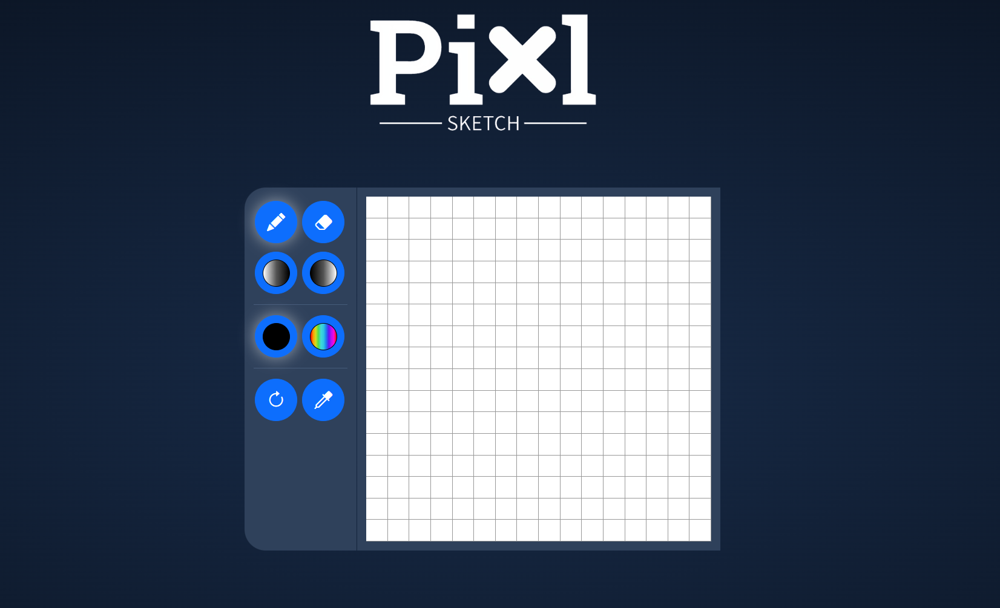

# Pixl Sketch

Pixl Sketch is an online sketching app created as a submission for [The Odin Project](https://www.theodinproject.com/lessons/foundations-etch-a-sketch). Play around with the [Live Demo](https://ivanprovci.github.io/pixl-sketch/)!

## Drawing Tools

**Pen -** Draw on the canvas\
**Eraser -** Erase the selected pixels\
**Darken -** Make the shading of the pixel darker\
**Lighten -** Make the shading of the pixel lighter

## Colour Selection

**RGB -** Standard RGB colour selector\
**Rainbow -** Creates a rainbow gradient as you draw with the pen

## Utilities

**Reset -** Revert to blank grid\
**Colour Picker -** Change your active colour to the one you select from the grid
